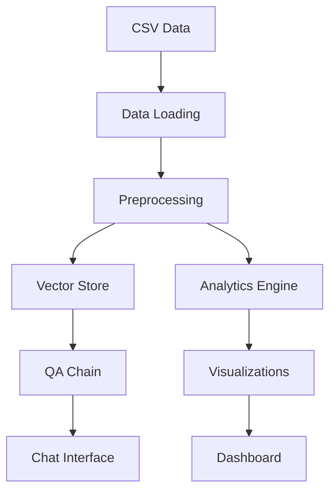

# Technical Documentation

## System Architecture

### 1. BusinessInsightsAgent Class

#### Core Components
```python
class BusinessInsightsAgent:
    def __init__(self, data_path: str):
        self.data_path = data_path
        self._refresh_data()
```

#### Key Methods

1. **Data Management**
```python
def _load_data(self, data_path: str) -> pd.DataFrame:
    """
    Loads and preprocesses CSV data
    - Calculates profit and margins
    - Formats dates
    - Sorts chronologically
    """

def _refresh_data(self):
    """
    Reinitializes components:
    - Reloads data
    - Rebuilds vector store
    - Resets memory
    - Updates QA chain
    """
```

2. **Vector Store Management**
```python
def _create_vectorstore(self) -> Chroma:
    """
    Creates ChromaDB vector store:
    - Converts data to documents
    - Generates embeddings
    - Maintains persistence
    """
```

3. **AI Components**
```python
def _setup_qa_chain(self) -> ConversationalRetrievalChain:
    """
    Configures QA pipeline:
    - Custom prompts
    - Retrieval chain
    - Memory management
    """
```

4. **Analytics Functions**
```python
def get_financial_metrics(self, period: str = None) -> Dict[str, float]:
    """
    Calculates key metrics:
    - Sales, Expenses, Profit
    - Margins, Customer metrics
    - Period-specific analysis
    """

def get_trend_analysis(self) -> Dict[str, List[Any]]:
    """
    Generates trend data:
    - Time series analysis
    - Growth calculations
    - Performance tracking
    """
```

### 2. Streamlit Interface

#### Page Structure
```python
def main():
    """
    Main application layout:
    1. Dashboard
    2. Chat Interface
    3. Financial Analysis
    4. Business Insights
    """
```

#### Components

1. **Data Management**
```python
# Session State
st.session_state.agent = BusinessInsightsAgent(data_path)
st.session_state.last_refresh = pd.Timestamp.now()

# File Upload
uploaded_file = st.sidebar.file_uploader("Upload new data (CSV)")
```

2. **Visualization Functions**
```python
def create_trend_chart(data: Dict[str, List], title: str) -> go.Figure:
    """
    Creates interactive Plotly charts:
    - Multiple metrics
    - Custom formatting
    - Responsive design
    """
```

3. **Chat Interface**
```python
# Message History
st.session_state.messages = []

# Chat Input/Output
response = st.session_state.agent.ask_question(prompt)
```

### 3. Data Flow



### 4. Configuration

#### Environment Setup
```bash
# Virtual Environment
python -m venv venv
source venv/bin/activate

# Dependencies
pip install -r requirements.txt

# Ollama Setup
ollama serve
ollama pull mistral
```

#### Project Structure
```
project/
├── app.py              # Streamlit interface
├── business_insights_agent.py  # Core logic
├── data/
│   └── sample_data.csv # Data file
├── requirements.txt    # Dependencies
└── README.md          # Documentation
```

### 5. API Reference

#### BusinessInsightsAgent

```python
# Initialization
agent = BusinessInsightsAgent(data_path="data/sample_data.csv")

# Data Operations
metrics = agent.get_financial_metrics(period="Jan-23")
trends = agent.get_trend_analysis()
recommendations = agent.generate_recommendations()

# AI Interaction
response = agent.ask_question("Analyze profit trends")
```

### 6. Error Handling

```python
try:
    # Data loading
    df = pd.read_csv(data_path)
    
    # Validation
    required_columns = [
        "Month", "Sales (INR)", "Expenses (INR)",
        "Customers", "Inventory Cost (INR)",
        "Marketing Spend (INR)"
    ]
    
    # Error handling
    if not all(col in df.columns for col in required_columns):
        raise ValueError("Missing required columns")
        
except Exception as e:
    st.error(f"Error: {str(e)}")
```

### 7. Performance Optimization

1. **Vector Store**
   - Persistent storage
   - Chunked processing
   - Efficient retrieval

2. **Data Processing**
   - Cached calculations
   - Optimized queries
   - Streamlined updates

3. **Memory Management**
   - Session state control
   - Resource cleanup
   - Efficient storage

### 8. Testing

```python
# Unit Tests
def test_data_loading():
    agent = BusinessInsightsAgent("test_data.csv")
    assert agent.data is not None
    assert len(agent.data) > 0

# Integration Tests
def test_qa_chain():
    response = agent.ask_question("test query")
    assert response is not None
    assert "answer" in response
```

### 9. Security Considerations

1. **Data Protection**
   - Local processing
   - No external API calls
   - Secure file handling

2. **Input Validation**
   - File type checking
   - Data sanitization
   - Error boundaries

3. **Access Control**
   - File system limits
   - Resource constraints
   - Usage monitoring

### 10. Maintenance

#### Regular Tasks
1. Update dependencies
2. Monitor performance
3. Backup vector store
4. Clean temporary files

#### Troubleshooting
1. Check Ollama connection
2. Verify data format
3. Monitor memory usage
4. Review error logs